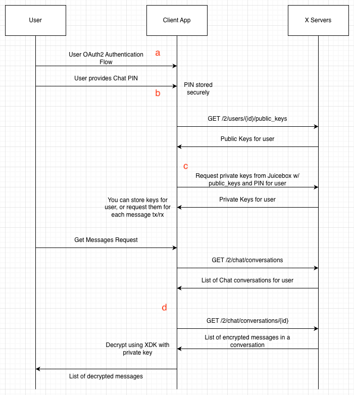
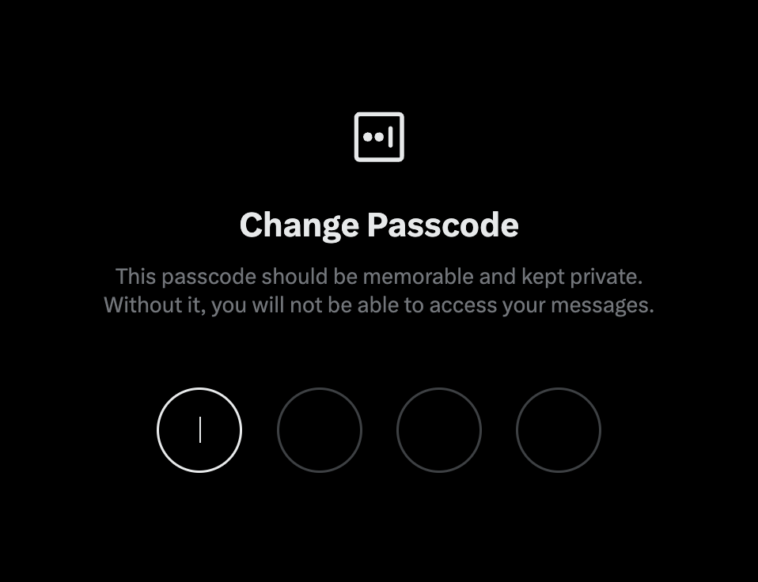
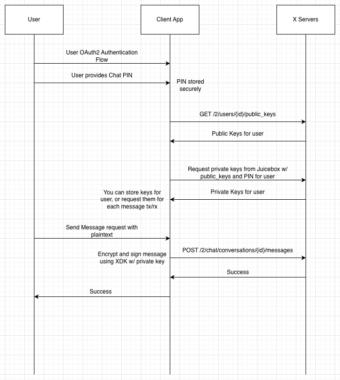
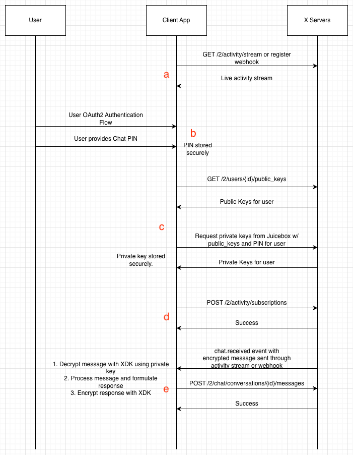

# XChat Enterprise User Migration Guide

Date Created: February 11, 2026

Authors: The X Developer API Team

## Table of Contents

- [Background / Rationale](#background)
    - [The Key Change](#the-key-change)
- [New Routes](#new-routes)
- [The XDKs](#the-xdks)
- [Request / Response Guide](#request-response)
    - [Getting User Messages](#getting-user-messages)
    - [Sending User Messages](#sending-messages)
- [Streaming / Automated Replies Guide](#streaming--automated-responses)
    - [The X Activity API](#the-x-activity-api)
    - [Creating a Reply Bot](#creating-a-reply-bot)
- [Important Information](#important-information)
    - [Conversation IDs and Groupchats](#conversation-ids-and-groupchats)

## Background

The X Platform has rewritten its Direct Messaging stack from the bottom up, shifting to a fully end-to-end encrypted model.

While this offers many benefits to users, there is an additional layer that our Enterprise users will need to adhere to in order to utilize this new stack for their customers.

This guide aims to make the transition (or new adoption) as easy as possible.

### The Key Change

The largest change is that the message stack is fully e2e encrypted. This means when you request messages for an authorized user, your app will receive an encrypted payload.

This requires the client application to perform decryption.

The same applies to sending messages. The client application will need to perform the encryption step and send the encrypted payload to the API.

We've developed custom X SDKs (or XDKs) that perform all of this functionality for you.

However, you _will_ need to store the numeric PINs for your users in a secure fashion. These PINs are used to retrieve the private keys of the user, which in turn are used to encrypt/decrypt their messages.

## New Routes

| Method | Route | Auth | Description |
| --- | --- | --- | --- |
| `GET` | `/2/users/{id}/public_keys` | User OAuth | Returns the public keys and Juicebox configuration for the specified user |
| `GET` | `/2/chat/conversations` | User OAuth | Retrieves a list of Chat conversations for the authenticated user’s inbox |
| `GET` | `/2/chat/conversations/{conversation_id}` | User OAuth | Retrieves messages and key change events for a specific Chat conversation with pagination support | 
| `POST` | `/2/chat/conversations/{conversation_id}/messages` | User OAuth | Send an encrypted message on behalf of a user to a specific chat conversation |

## The XDKs

X offers SDKs (XDKs) to make interacting with our API easier, including handling the encryption/decryption logic for chat.

Our general XDK for handling auth, sending requests, opening streams, registering webhooks, etc. are supported in Python and TypeScript:

| Language | Package | Repo |
| --- | --- | --- |
| Python | `pip install xdk` | [xdk-python](https://github.com/xdevplatform/xdk-python) |
| TypeScript | `npm install @xdevplatform/xdk` | [xdk-typescript](https://github.com/xdevplatform/xdk-typescript) |

We have a separate XDK for handling chat encryption/decryption. You can find it here:

| Language | Package | Repo |
| --- | --- | --- |
| Rust w/ Python Bindings | Still in security review for release. You will have to clone the repo and build from source in its current state. Build instructions are included in the README | [chat-xdk](https://github.com/xdevplatform/chat-xdk) |

## Request / Response Guide

This section details how to interact with the request/response routes to interact with the XChat API.

### Login / User Auth

For all routes, you will be required to provide OAuth2 access tokens from your users.

Check out our docs for a reference: [OAuth 2.0 Flow with PKCE](https://docs.x.com/fundamentals/authentication/oauth-2-0/authorization-code#oauth-2-0-authorization-code-flow-with-pkce)

### Getting User Messages

|  |
|:--:|
| Flow for retrieving user messages |

- a. User OAuth2 flow
- b. Your client app needs to request the user's XChat PIN. This is the numeric PIN they set up when using the Chat feature within the X app:

|  |
|:--:|
| User PIN Prompt |

- c. Getting user keys is a 2 step process. First, use the GET route to retrieve the user's public keys. Then, use the XDK in conjunction with the user's public key and PIN to retrieve the user's private key from the secure juicebox key store.

- **NOTE**: If you decide to store the user's private key, you should do so in a secure manner. Treat it like a password or their PIN.

- d. Your app is now able to use the XDK to decrypt the user's encrypted messages. Retrieve their conversations, and then retrieve messages for specific conversation ids. The decrypted payloads can then be displayed to your users.

### Sending Messages

|  |
|:--:|
| Flow for sending user messages |

The flow for sending messages on behalf of your users is roughly the same, just reversed.

The user will send their message to your app, your app will encrypt using the XDK with their private key, and then use the POST endpoint to send.

This exact flow will be used if the user is manually requesting to send messages via your app. See the streaming section for automated replies.

## Streaming / Automated Responses

This section will cover how to get messages in real-time and send automatic replies; Great for customer service or reply bots.

### The X Activity API

To receive chat messages in real-time on behalf of your users, you'll need to use our new real-time activity subscription suite called the X Activity API (or XAA).

You can check out the docs [here](https://docs.x.com/x-api/activity/introduction)

XAA works with a subscription/filter model. You'll subscribe to an event type, in this case `chat.received` for messages your users receive and `chat.sent` if you'd like events when your users send messages, and apply a filter.

Filters can generally take on different forms, but `chat` subscriptions can only be filtered by user id. So for each user you are interested in getting real-time events for, you'll create a separate subscription using each user ID as a filter.

For example, if I want to get a real-time event whenever user `123` receives a chat message, I would provide this request:

```
POST /2/activity/subscriptions -d '{"event_type": "chat.received", "filter": {"user_id": "123"}, "tag": "user 123 chat events"}'
```

The `tag` field is optional, but may be useful for internal bookkeeping.

You'll use user `123`'s OAuth2 token to authenticate to this endpoint.

You can then open a stream, which is a persistent HTTP connection:

```
GET /2/activity/stream
```

This stream will stay open as long as you keep it open, but we recommend implementing some robust retry logic for reliability.

If you'd prefer, the X Activity API also supports webhook delivery. When creating the `chat.received` subscription, you'll simply pass in your `webhook_id` and it will deliver events automatically. Check out the docs [here](https://docs.x.com/x-api/webhooks/introduction) for reference.

### Creating a Reply Bot

To create the chat bot, you'll create an app that consumes from the activity stream (or webhook), and then set up reply logic when an event is received, using the appropriate users' keys.

|  |
|:--:|
| A sample flow for reply bot |

- a. Your client app either opens the activity stream or registers a webhook. You'll be able to add/remove user subscriptions while the stream is open without refreshing.

- b. Normal OAuth2 user login flow, and PIN request, as covered in previous sections. If the user ever changes their PIN, they'll have to repeat this step.

- c. Request the user's public key, and use the PIN to request the private key. In this sample flow, we incorporate key storage. Alternatively, you can unlock the private key for each message event, and then won't have to store, but design is up to you.

- d. Create the user's activity subscription for `chat.received` messages. When this user receives a message now, it will come through your stream or webhook that you set up in step a. If you're using a webhook, you'll provide the `webhook_id` when creating the subscription.

- e. This is the event loop. When an event arrives through your stream or webhook, you'll decrypt using the appropriate user's key. You'll then perform any message processing with the decrypted message (For LLM processing, please work with your sales representative for potential deals/discounts on the Grok API if that interests you). You'll then encrypt the response and send, just as we did in the previous section.

## Important Information

This section covers other important information about the new Chat service that may help smooth over some potential bumps and questions.

### Conversation IDs and Groupchats

For reply bots in particular, it may be helpful to distinguish whether you are replying to message from a direct user, or from a groupchat.

For example, you'll want to reply to any messages received in a one-on-one conversation between a customer and your reply bot, but in groupchats you may only want to reply when the bot is tagged (i.e. @bot_username)

To make this distinction, you can use the conversation id. Conversation ids in a one-to-one conversation with simply be the two user ids separate by a dash, for example: `123456789-987654321` is a conversation between user `123456789` and user `987654321`.

Groupchats on the other hand have their own unique ids, and are prefixed by a `g`, for example `g123456789`. The ID does not contain any other relevant information in terms of receipients, but the `g` can be used to tell quickly if the message is coming from a groupchat or not.
